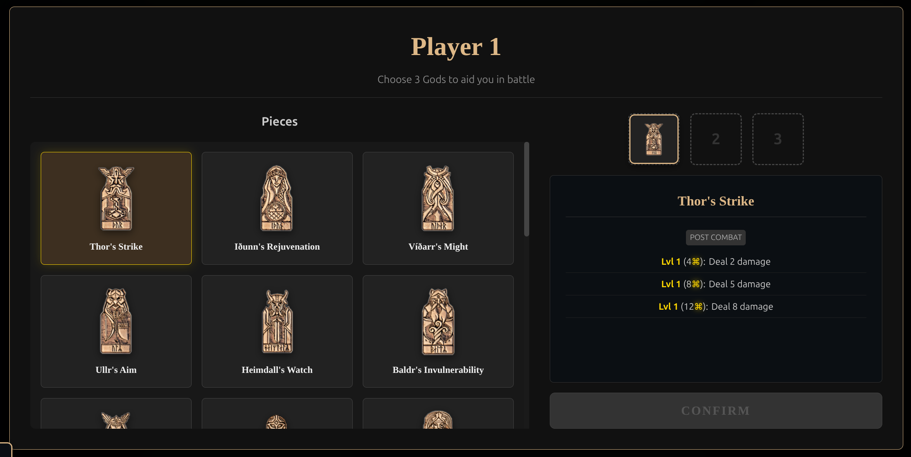
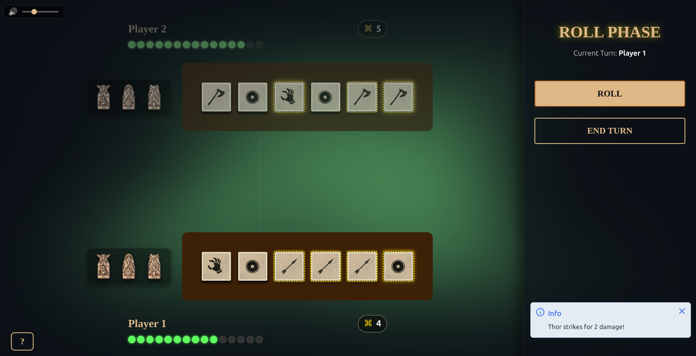
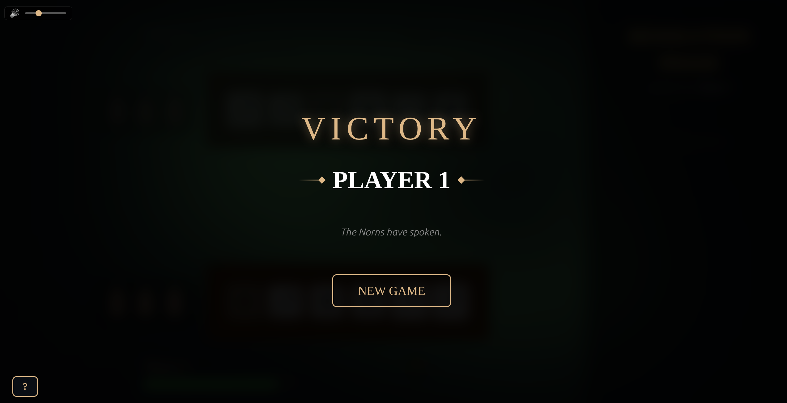

# Orlog - Web Implementation

> A web-based recreation of the **Orlog** dice game from *Assassin's Creed Valhalla*. This project implements the core rules, combat logic, and God Favor mechanics in a browser environment, currently supporting local PvP (hotseat) gameplay.

### 📸 Screenshots

| God Selection | Battlefield | Victory Screen |
|:---:|:---:|:---:|
|  |  |  |

## 🛠 Tech Stack

* **Framework:** Vue 3 (Composition API, `<script setup>`)
* **Language:** TypeScript (Strict typing)
* **Build Tool:** Vite
* **Animations:** GSAP (GreenSock) for complex timelines (combat, dice rolls)
* **Testing:** Vitest
* **Styling:** Native CSS3 (Scoped, CSS Variables)
---

## 🏗 Architecture & Patterns

The project separates core game logic from the UI layer to ensure testability and cleaner state management.

### 1. Phase-Based State Machine
The game flow is controlled by a central `Game` class that transitions between distinct phases. This ensures strict rule enforcement (e.g., players cannot roll dice during the resolution phase).
* `RollPhase`: Handles dice selection, rerolls (up to 3), and turn alternation.
* `ResolutionPhase`: Calculates damage, defense, and resource generation in a deterministic sequence.

### 2. Strategy Pattern for God Favors
 > God Favors (special abilities) are implemented using the Strategy Pattern. Each God is a separate class implementing the `IGodFavor` interface.
* **Extensible:** New favors (e.g., *Freyja's Plenty*, *Mimir's Wisdom*) can be added without modifying the core game loop.
* **Priority System:** Favors declare a priority (`PRE_COMBAT` or `POST_COMBAT`) to determine execution order.
* **Payloads:** Supports interactive favors (selecting specific dice) and scalar favors (sacrificing health).

### 3. Separation of Concerns
* **Core Logic (`src/core`):** Pure TypeScript classes (`Player`, `Die`, `Game`) that handle the data modeling and business rules.
* **UI Layer (`src/components`):** Vue components that react to state changes.
* **Composables:** Bridges like `useGame` and `useCombatAnimation` connect the reactive UI to the imperative game logic.
---

## 🚀 Features

* **Complete Game Loop:** Rolling, keeping dice, resolution, and health tracking.
* **God Favors System:** Fully implemented drafting phase and ability execution (Healing, Direct Damage, Dice Manipulation).
* **Dynamic UI:**
    * Interactive Dice Tray with 3D-style CSS transformations.
    * Adaptive modals for God selection and interactive abilities.
    * Combat animations showing attacks, blocks, and damage.
* **Audio System:** Singleton `AudioManager` handling BGM, SFX, and volume control.
---

## 🔮 Future Roadmap

* **UI Polish:** Further improvements to responsiveness on smaller mobile devices.
* **Single Player:** Implement a decision tree or Minimax algorithm to allow play against the computer.
* **Network Play:** WebSocket integration for remote multiplayer.

---
## 📦 Setup & Run

1.  **Clone the repository**
    ```bash
    git clone https://github.com/sansarc/orlog.git
    cd orlog-game
    ```

2.  **Install dependencies**
    ```bash
    npm install
    ```

3.  **Run development server**
    ```bash
    npm run dev
    ```

4.  **Run tests**
    ```bash
    npm test
    ```

---
### ⚖️ Legal & Credits

This is a non-commercial, fan-made project created for educational and portfolio purposes only.

* **Game Design & IP:** Orlog is a game from *Assassin's Creed Valhalla*, developed and published by Ubisoft. I do not claim ownership of the game mechanics, name, or visual assets.
* **Icons:** Sourced from the [Assassin's Creed Wiki](https://assassinscreed.fandom.com/).
* **Audio:** Background music and sound effects are used for atmosphere and are property of their respective composers/owners.

If you are a copyright holder and wish for specific assets to be removed, please contact me.